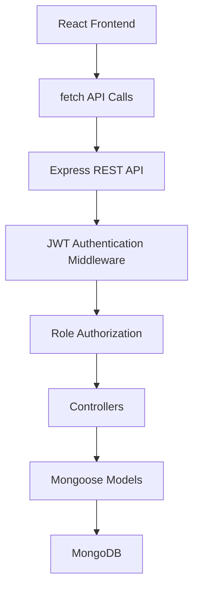

# Smart Operations Management System

## Overview

Smart Operations Management System is a full-stack operations and project management application for organizing projects, assigning work, tracking task progress, and monitoring team activity through a centralized dashboard.

The application combines role-aware access control with project and task workflows. Managers and admins can create and manage projects, assign team members, create tasks, and review audit history. Employees can access only the projects and tasks scoped to their team membership and assigned work.

## Key Features

### Authentication and User Access

- User registration and login
- Authenticated user profile endpoint
- Role-based access control with `admin`, `manager`, and `employee` roles
- JWT-based authentication using Bearer tokens
- Employee resource scoping for projects and tasks

### Dashboard and Analytics

- Role-scoped dashboard metrics
- Project summary counts by status
- Task summary counts by status and priority
- Employee workload breakdown
- Project completion progress tracking
- Overdue task visibility

### Project Management

- Create, read, update, and delete projects
- Project status tracking: `planned`, `active`, `completed`, `cancelled`
- Team member assignment to projects
- Project activity and audit history
- Project deletion protection when tasks still exist

### Task Management

- Create, read, update, and delete tasks
- Task assignment and reassignment
- Server-side task filtering, sorting, search, and pagination
- Task priority tracking: `low`, `medium`, `high`, `critical`
- Task status transitions enforced by a backend state machine
- Task comments and discussion history
- Task activity and audit history

### Platform and Operations

- API health endpoint
- Unified frontend and backend development workflow
- Production static serving of the built frontend through Express

## Tech Stack

### Frontend

- React 19
- TypeScript
- Vite 6
- Tailwind CSS v4
- Lucide React

### Backend

- Node.js
- Express 4
- TypeScript

### Database

- MongoDB
- Mongoose

### Authentication and Security

- JWT authentication
- `bcryptjs` password hashing
- Authorization via Bearer token headers
- Client token storage in `localStorage`

### Tooling

- Vite
- `tsx`
- `esbuild`
- TypeScript compiler

## System Architecture



## Application Flow

1. The React frontend sends requests to relative `/api/...` endpoints using `fetch()`.
2. Protected requests include `Authorization: Bearer <token>`.
3. Express routes forward requests through authentication middleware.
4. Role checks are enforced where required with authorization middleware and controller-level access rules.
5. Controllers validate input, enforce business rules, and query Mongoose models.
6. Mongoose persists and retrieves data from MongoDB.
7. JSON responses are returned to the frontend for dashboard, project, task, and auth views.

## Project Structure

```text
smart-operations-management-system/
├── server.ts
├── package.json
├── vite.config.ts
├── tsconfig.json
├── .env.example
├── src/
│   ├── App.tsx
│   ├── main.tsx
│   ├── index.css
│   ├── components/
│   │   ├── AuthModal.tsx
│   │   ├── DashboardView.tsx
│   │   ├── DeleteConfirmModal.tsx
│   │   ├── Header.tsx
│   │   ├── ProjectCard.tsx
│   │   ├── ProjectDetailModal.tsx
│   │   ├── ProjectModal.tsx
│   │   ├── TaskCard.tsx
│   │   ├── TaskDeleteConfirmModal.tsx
│   │   ├── TaskDetailModal.tsx
│   │   └── TaskModal.tsx
│   └── types/
│       └── index.ts
└── server/
    └── src/
        ├── config/
        │   └── db.ts
        ├── controllers/
        │   ├── authController.ts
        │   ├── dashboardController.ts
        │   ├── projectController.ts
        │   ├── taskController.ts
        │   └── userController.ts
        ├── middleware/
        │   └── auth.ts
        ├── models/
        │   ├── Activity.ts
        │   ├── Project.ts
        │   ├── Task.ts
        │   ├── User.ts
        │   └── index.ts
        ├── routes/
        │   ├── auth.ts
        │   ├── dashboard.ts
        │   ├── projects.ts
        │   ├── tasks.ts
        │   └── users.ts
        └── utils/
            ├── jwt.ts
            └── password.ts
```

## Database Design

### User

Stores application users and authentication-related account data.

- `userId`
- `name`
- `email`
- `passwordHash`
- `role`
- timestamps

### Project

Stores project metadata and team membership.

- `projectId`
- `name`
- `description`
- `startDate`
- `deadline`
- `status`
- `teamMembers` -> references `User`
- timestamps

### Task

Stores individual work items linked to projects and optionally assigned users.

- `taskId`
- `title`
- `description`
- `priority`
- `status`
- `assignedTo` -> references `User`
- `projectId` -> references `Project`
- `dueDate`
- `comments[]` with embedded comment records containing `userId` references
- timestamps

### Activity

Stores audit trail records for project and task actions.

- `userId` -> references `User`
- `action`
- `entity`
- `previousValue`
- `newValue`
- `timestamp`

### Relationships

- A project can contain many team members through `Project.teamMembers`.
- A task belongs to one project through `Task.projectId`.
- A task can be assigned to one user through `Task.assignedTo`.
- A task can contain many comments, and each comment references the user who posted it.
- An activity record references the user who performed the action.

## Authentication & Authorization

### Registration and Login

- Users register through `POST /api/auth/register`.
- Users authenticate through `POST /api/auth/login`.
- Authenticated profile retrieval is available through `GET /api/auth/me`.

### Password Hashing

- Passwords are validated for minimum strength requirements before storage.
- Passwords are hashed with `bcryptjs` before being saved.
- `passwordHash` is excluded from normal user query output by default.

### JWT Flow

- After registration or login, the backend generates a signed JWT.
- The frontend stores the token in `localStorage` under `auth_token`.
- Protected requests send the token using the `Authorization: Bearer <token>` header.
- The backend verifies the token in authentication middleware before allowing access.

### Authorization Model

- `admin` and `manager` can create and manage projects and tasks.
- `employee` access is restricted to resources scoped to their project membership.
- Employees can only update tasks assigned directly to them.
- Employees can only change status for tasks assigned directly to them.
- Additional role-check endpoints exist for `admin`, `manager/admin`, and authenticated staff verification.

## API Documentation

| Method | Endpoint | Authentication | Purpose |
|---|---|---|---|
| `POST` | `/api/auth/register` | Public | Register a new user |
| `POST` | `/api/auth/login` | Public | Authenticate a user and return a JWT |
| `GET` | `/api/auth/me` | Required | Return the authenticated user's profile |
| `GET` | `/api/auth/admin-check` | Admin | Verify admin-only authorization |
| `GET` | `/api/auth/manager-check` | Manager or Admin | Verify manager/admin authorization |
| `GET` | `/api/auth/employee-check` | Authenticated User | Verify authenticated staff authorization |
| `GET` | `/api/projects` | Required | List projects scoped to the authenticated user |
| `POST` | `/api/projects` | Manager or Admin | Create a project |
| `GET` | `/api/projects/:projectId` | Required | Get a single project |
| `PUT` | `/api/projects/:projectId` | Manager or Admin | Update a project |
| `PUT` | `/api/projects/:projectId/team` | Manager or Admin | Update project team membership |
| `DELETE` | `/api/projects/:projectId` | Manager or Admin | Delete a project if it has no tasks |
| `GET` | `/api/projects/:projectId/activities` | Required | Get project audit history |
| `GET` | `/api/users` | Required | List users for team selection and assignment |
| `GET` | `/api/tasks` | Required | List tasks with filtering, search, sorting, and pagination |
| `POST` | `/api/tasks` | Manager or Admin | Create a task |
| `GET` | `/api/tasks/:taskId` | Required | Get a single task |
| `PUT` | `/api/tasks/:taskId` | Required | Update a task with role-based restrictions |
| `PUT` | `/api/tasks/:taskId/assign` | Manager or Admin | Assign or reassign a task |
| `PATCH` | `/api/tasks/:taskId/status` | Required | Change task status using the transition rules |
| `POST` | `/api/tasks/:taskId/comments` | Required | Add a comment to a task |
| `DELETE` | `/api/tasks/:taskId` | Manager or Admin | Delete a task |
| `GET` | `/api/tasks/:taskId/activities` | Required | Get task audit history |
| `GET` | `/api/dashboard` | Required | Return role-scoped dashboard analytics |
| `GET` | `/api/health` | Public | Return API and database health information |

## Environment Variables

Create a `.env` file in the project root and configure the following variables.

| Variable | Required | Purpose |
|---|---|---|
| `MONGODB_URI` | Yes | MongoDB connection string used by the backend |
| `JWT_SECRET` | Yes | Secret key used to sign and verify JWTs |
| `JWT_EXPIRES_IN` | Yes | JWT expiration window |
| `ADMIN_REGISTRATION_SECRET` | Yes | Secret required to create admin accounts through public registration |
| `NODE_ENV` | Runtime-dependent | Controls development vs production server behavior |
| `DISABLE_HMR` | Optional | Controls Vite HMR and file watching behavior |

Do not commit real secrets to source control.

## Installation

### Prerequisites

- Node.js
- MongoDB instance accessible through `MONGODB_URI`

### Setup

```bash
git clone <repository-url>
cd smart-operations-management-system
npm install
```

Create a `.env` file based on `.env.example`, then provide a valid MongoDB connection string and JWT configuration.

### Run in Development

```bash
npm run dev
```

The development command starts the Express server entry point, which also mounts the Vite-powered frontend during development.

## Available Scripts

| Command | Purpose |
|---|---|
| `npm install` | Install project dependencies |
| `npm run dev` | Start the development server using `tsx server.ts` |
| `npm run build` | Build the frontend with Vite and bundle the server with `esbuild` |
| `npm run start` | Run the production server from `dist/server.cjs` |
| `npm run preview` | Preview the Vite frontend build |
| `npm run lint` | Run TypeScript type-checking with `tsc --noEmit` |

## Security

### Implemented Security

- Password hashing with `bcryptjs`
- Password strength validation
- Email format validation
- Duplicate email prevention during registration
- JWT authentication
- Bearer token verification middleware
- Role-based authorization middleware
- Employee resource scoping for projects and tasks
- Admin registration secret enforcement
- Task status transition enforcement through a state machine
- Project deletion guard when dependent tasks exist
- Audit logging for project and task actions

### Current Limitations / Future Improvements

- No Helmet middleware
- No CORS middleware
- No rate limiting
- No HttpOnly cookie-based authentication
- No CSRF protection
- JWT secret currently has a fallback development secret path in code if `JWT_SECRET` is missing

## Testing

Automated tests are not currently implemented.

This repository does not currently include:

- a test framework
- a test script in `package.json`
- automated backend tests
- automated frontend tests

## Production Build

The verified production flow is:

```bash
npm run build
npm run start
```


